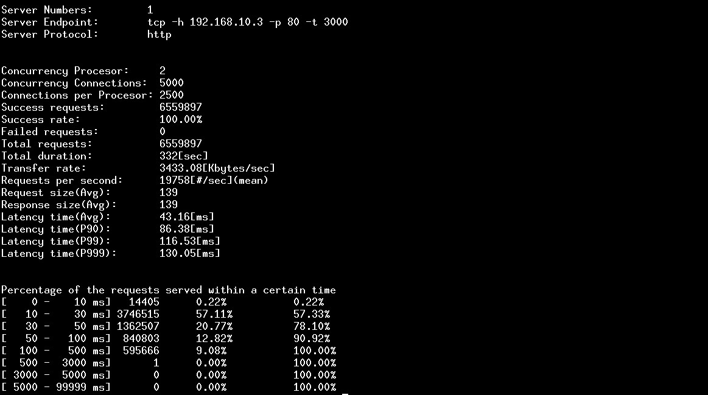

## Case Instructions

This is a example of how to use the tb to benchmark http service.

The following step example describes how to start tb, then the tool continuously sends the Post request to the http server, and the server returns the result to the tb client correctly. After the test is completed, The response resule will be displaying in the console.

### 1.1. Startup example
```text
./tb -n 2 -c 5000 -s 20000 -D 192.168.10.3 -P 80 -p http -i 10 -u "http://192.168.16.1/cgi-bin/proxy?cmd=test&f=json" -F aa.txt
```

http protocol parameter description
```text
  -H(Optional)             :Set Header. It is recommended to modify it with "".
  -C(Optional)             :Set Cookie. It is recommended to modify it with "".
  -F(Optional)             :The file of post content. Default is GET request.
  -u(Optional)             :Destination URL address
```

### 1.2. Closing example
Initiative close: ctrl+C or killall tb，Wait a few seconds and then output the final statistical results.<br/>
Passive close: The default duration is 1 hour. After 1 hour, the benchmark tool will bt stopped and the statistical results are output. This time can be adjusted by the-I parameter.


### 1.3. Display the results
