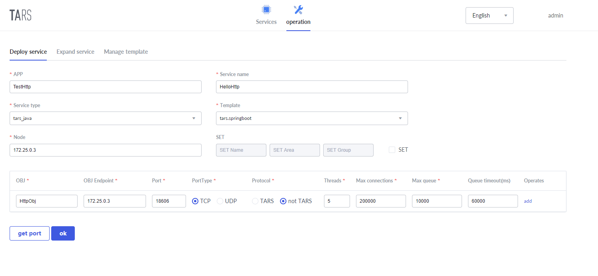

# Tars HTTP Server Guide

## Intro

HTTP service is well supported on Tars. You can easily mark a service as an HTTP service by using `@TarsHttpService` annotation.

## Examples

[tars-spring-boot-http-server](https://github.com/TarsCloud/TarsJava/tree/master/examples/tars-spring-boot-http-server)


## Development Guide

### Directories

```text
├── pom.xml
└── src
   └── main
       ├── java
       │   └── com.tecent.tars
       |       ├── App.java
       │       ├── client.testapp
       │       |   ├── HelloPrx.java
       │       |   └── HelloPrxCallback.java
       │       |
       |       └──http.server 
       │          └── HelloController.java
       └── resources
           └── hello.tars
```


### Dependency Configuration

Add below configure into pom.xml:

**Spring Boot and Tars Framework dependency**

```xml
  <parent>
    <groupId>org.springframework.boot</groupId>
    <artifactId>spring-boot-starter-parent</artifactId>
    <version>2.1.6.RELEASE</version>
  </parent>

  <dependencies>
    <dependency>
        <groupId>org.springframework.boot</groupId>
        <artifactId>spring-boot-starter-web</artifactId>
    </dependency>
    <dependency>
      <groupId>com.tencent.tars</groupId>
      <artifactId>tars-spring-boot-starter</artifactId>
      <version>1.7.0-SNAPSHOT</version>
    </dependency>
  </dependencies>
```

**Plugins Dependency**

```xml
<!--tars2java-->
<plugin>
	<groupId>com.tencent.tars</groupId>
	<artifactId>tars-maven-plugin</artifactId>
	<version>1.7.0</version>
	<configuration>
		<tars2JavaConfig>
			<!-- tars file location -->
			<tarsFiles>
				<tarsFile>${basedir}/src/main/resources/hello.tars</tarsFile>
			</tarsFiles>
			<!-- file encoding format -->
			<tarsFileCharset>UTF-8</tarsFileCharset>
			<!-- true for server code generating -->
			<servant>false</servant>
			<!-- code generating encoding format -->
			<charset>UTF-8</charset>
			<!-- target direcotry of code generating -->
			<srcPath>${basedir}/src/main/java</srcPath>
			<!-- package prefix for code generating -->
			<packagePrefixName>com.tencent.tars.client.</packagePrefixName>
		</tars2JavaConfig>
	</configuration>
</plugin>
<!--packaging plugins-->
<plugin>
    <groupId>org.apache.maven.plugins</groupId>
    <artifactId>maven-jar-plugin</artifactId>
     <version>2.6</version>
     <configuration>
         <archive>
             <manifestEntries>
                 <Class-Path>conf/</Class-Path>
             </manifestEntries>
          </archive>
     </configuration>
</plugin>
<plugin>
    <groupId>org.springframework.boot</groupId>
    <artifactId>spring-boot-maven-plugin</artifactId>
    <configuration>
        <!-- main class for packaging-->
        <mainClass>com.tencent.tars.App</mainClass>
    </configuration>
    <executions>
        <execution>
            <goals>
                <goal>repackage</goal>
             </goals>
     </executions>
</plugin>
```

### Generating Server Code by Tars Plugin

We should generate client code for the server interface at first. Please copy the file `hello.tars` to `resources` directory and execute `mvn tars:tars2java` at the project root directory. You will get the proxy interface code once the command was finished. There're three usable ways for you to call the server interfaces. Please see below:

```java
@Servant
public interface HelloPrx {

	 String hello(int no, String name);

	CompletableFuture<String>  promise_hello(int no, String name);

	 String hello(int no, String name, @TarsContext java.util.Map<String, String> ctx);

	 void async_hello(@TarsCallback HelloPrxCallback callback, int no, String name);

	 void async_hello(@TarsCallback HelloPrxCallback callback, int no, String name, @TarsContext java.util.Map<String, String> ctx);
}
```


#### Coding Your Controller

Create your `HelloController.java` and add `@TarsHttpService` to the controller annotation for HTTP service.

```java
@TarsHttpService("HttpObj")
@RestController
public class HelloController {
    @TarsClient("TestServer.HelloServer.HelloObj")
    HelloPrx helloPrx;

    @RequestMapping("/hello")
    public String testHello(@RequestParam Integer no){
        String ret = helloPrx.hello(no, "Hello World");
        return ret;
    }
}
```


#### Switch Tars Service On

Add annotation `@EnableTarsServer` to switch on Tars Service in the boot class of Spring Boot.

```java
@SpringBootApplication
@EnableTarsServer
public class App {
    public static void main( String[] args ){
        SpringApplication.run(App.class, args);
    }
}
```


#### Service Packaging

Execute `mvn package` to build a jar package for your service deploy.

## Service Deploy

The deployment of HTTP Service is similar to[Tars Service Deploy](dev/tarsjava/tars-quick-start.md). The only difference is that you should choose TARS protocol instead of Not Tars. See below：




## Test Your Service

You can test your service via any HTTP client. **Please make sure the IP you're using for testing is reachable (internal or external) in your current environment**

