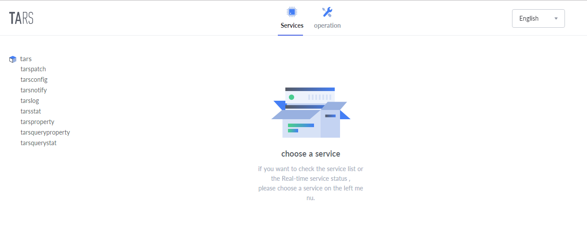
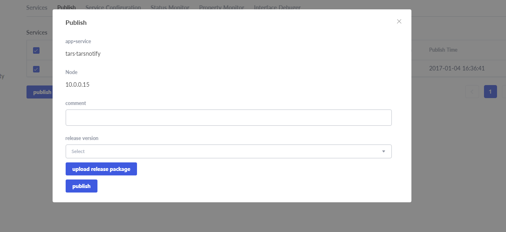

# Installation Notes

* This article describe how to deploy a TARS environment on a stand-alone server. To install TARS-PHP, please refer to [Building a PHP Environment] (./php.md). For service development, please refer to [Quick Start] (../QuickStart) .
* Operating system version used in this article: centOs7.2
* Database version used in this article: mysql5.7
* Commands in this article require root privileges, and the server must be connected to the network.

### 1. Install tools

Install dependencies of C++ language framework.

```
yum update -y
sudo yum install -y glibc-devel cmake ncurses-devel zlib-devel perl flex bison net-tools vim git yum-config-manager yum-utils gcc gcc-c++
```

### 2. Install mysql5.7

Install dependencies of TARS.If the download is slow, you can try to change the default yum source of centOs to a domestic yum image.

```
yum install https://dev.mysql.com/get/mysql-community-release-el7-5.noarch.rpm -y
yum-config-manager --disable mysql56-community
yum-config-manager --enable mysql57-community-dmr
yum install mysql mysql-devel mysql-server mysql-utilities -y
```

### 3. Install pm2

Install dependencies of Web Management System.

```
wget -qO- https://raw.githubusercontent.com/creationix/nvm/v0.33.11/install.sh | bash
source ~/.bashrc
nvm install v8.11.3
npm install -g pm2
```

### 4. Install TARS

##### 4.1 Download TarsFramework Source

```
git clone https://github.com/TarsCloud/TarsFramework.git
```

##### 4.2 Checking MySQL Path

**Check the CMakeLists.txt file in the source directory to ensure that the relevant path configuration of MYSQL is consistent with your machine.**

For example, if you install mysql in centos7.2 using yum, mysql lib files default path is `/usr/lib64/mysql` and mysql include folder default path is `/usr/include/mysql/`. You can change MYSQL_DIR_LIB in the CMakeLists.txt file to "/usr/lib64/mysql" or use `cp -r /usr/include/mysql/* /usr/local/mysql/include` to copy the file to the specified path `/usr/local/mysql/include`.

```
set(MYSQL_DIR_INC "/usr/local/mysql/include")
set(MYSQL_DIR_LIB "/usr/lib64/mysql")
```

##### 4.3 Compile and install TARS

```
cd {$source_folder}/build
chmod u+x build.sh
./build.sh prepare
./build.sh all
```

Recompile, please use

```
./build.sh cleanall
./build.sh all
```

### 5. Database environment initialization

##### 5.1 Modify the mysql initial password to root@appinside

Commends of modify initial password of different versions of mysql is different, you can modify initial password of mysql5.7 on centOs7.2 mysql5.7 initial following.

```
service mysqld start
cat /var/log/mysqld.log | grep password  // 复制mysql初始密码7zi;e3lNXV,
mysql -uroot -p 
Enter password: // 输入初始密码，进入mysql
mysql>update user set authentication_string = password("root@appinside") where user="root";
mysql>\q
service mysqld restart
```

##### 5.2 Add users

$ {your machine ip} needs to be modified to the internal IP of your machine, which can be viewed by `ifconfig`.

```
grant all on *.* to 'tars'@'%' identified by 'tars2015' with grant option;
grant all on *.* to 'tars'@'localhost' identified by 'tars2015' with grant option;
grant all on *.* to 'tars'@'${your machine ip}' identified by 'tars2015' with grant option;
flush privileges;
```

##### 5.3 Create Database

Enter {$source_folder}/sql

```
cd {$source_folder}/sql 
```

Modify the deployed IP to your intranet IP

```
sed -i "s/192.168.2.131/${your machine ip}/g" `grep 192.168.2.131 -rl ./*`
sed -i "s/db.tars.com/${your machine ip}/g" `grep db.tars.com -rl ./*`
sed -i "s/10.120.129.226/${your machine ip}/g" `grep 10.120.129.226 -rl ./*`
```

Execute exec-sql.sh

```
chmod u+x exec-sql.sh
./exec-sql.sh
```

Script will create three databases:db_tars, tars_stat and tars_property.
* db_tars: Core database for service deployment data, service template data, service configuration data etc.;
* tars_stat: Database for service monitoring data;
* tars_property: Database for service property monitoring data;

### 6. Install Framework Basic Services

There are two types of framework services:

* Core basic services: tarsAdminRegistry, tarsregistry, tarsnode, tarsconfig, tarspatch
* Common basic services: tarsstat, tarsproperty, tarsnotify, tarslog, tarsquerystat, tarsqueryproperty

Core basic services must be deployed manually, while common basic services can be published through the operation platform.

##### 6.1 Preparing core basic service packages

```
cd {$source_folder}/build
make framework-tar
```

Command will generate framework.tgz in current directory.This package contains deployment related files of tarsAdminRegistry, tarsregistry, tarsnode, tarsconfig, tarspatch.

##### 6.2 Preparing the installation package for common basic services

```
make tarsstat-tar
make tarsnotify-tar
make tarsproperty-tar
make tarslog-tar
make tarsquerystat-tar
make tarsqueryproperty-tar
```

Command will generate basic service release package in the current directory which can be released by operation platform.

##### 6.3 Install Core Basic Services

Copy the core basic service package to the `/usr/local/app/tars` and then extract it.

```
mkdir -p /usr/local/app/tars
cp {$source_folder}/build/framework.tgz /usr/local/app/tars
cd /usr/local/app/tars
tar zxvf framework.tgz
```

Modify the configuration files of each service, pay attention to changing the IP address to your local network IP address.

```$xslt
cd /usr/local/app/tars
sed -i "s/192.168.2.131/${your_machine_ip}/g" `grep 192.168.2.131 -rl ./*`
sed -i "s/db.tars.com/${your_machine_ip}/g" `grep db.tars.com -rl ./*`
sed -i "s/registry.tars.com/${your_machine_ip}/g" `grep registry.tars.com -rl ./*`
sed -i "s/web.tars.com/${your_machine_ip}/g" `grep web.tars.com -rl ./*`
```

Then execute the script in `/usr/local/app/tars/` to start the tars framework.

```$xslt
chmod u+x tars_install.sh
./tars_install.sh
```

Deploy management platform and launch it.

```$xslt
tarspatch/util/init.sh
```

##### 6.4. Install web management platform

Download web source.

```$xslt
git clone https://github.com/TarsCloud/TarsWeb
```

Modify the configuration file of source code and change the ip address to your internal network IP address.

```$xslt
cd {$web_source_folder}
sed -i 's/db.tars.com/${your_machine_ip}/g' config/webConf.js
sed -i 's/registry.tars.com/${your_machine_ip}/g' config/tars.conf
```

Install and start web management page.

```$xslt
cd {$web_source_folder}
npm install --registry=https://registry.npm.taobao.org
npm run prd
```

Create log directory.

```$xslt
mkdir -p /data/log/tars
```

Visit `${your machine ip}:3000` in your browser，then you can see the web management interface. If you can’t access it, please try to close the firewall.



##### 6.5 Install common basic services

**Ensure the ports have no conflicts,the port used in this article just for reference.**

The deployment information of the common basic service has been initialized while installing the core basic service. Therefore, you only need to publish it in operation platform. There describe operations of install tarsstat.

Click `Operations Management` => `Service Deployment`


Click `service management` => select a service => `release management`, upload the release package, which is the basic release package generated in 6.2, and click release.



Deploy tarsnotify, tarsproperty, tarslog, tarsquerystat, tarsqueryproperty one by one in this way.

**Please select the corresponding template of the service on the service deployment page. For example, the tarsstat template is tars.tarsstat and the tarsproperty template is tars.tarsproperty.**

**Note that the protocol of tarsquerystat and tarsqueryproperty is non-TARS, and other options are TARS.**

## Appendix
* Please prepare software according to this page before installing: https://github.com/TarsCloud/Tars/tree/master/build
* It is recommended to read this page first: https://github.com/TarsCloud/Tars/blob/master/build/install.sh
    (In fact, dependencies of some software are automatically installed in scripts to avoid repeated labor, but it is better to familiar with the general script installation process)
* You also can install TARS with this installation instructions: https://github.com/TarsCloud/Tars/blob/master/Install.zh.md
* For common problems and precautions encountered during installation, please read: https://github.com/TarsCloud/Tars/blob/master/Install_faq.zh.md
* Installation instruction video: https://www.bilibili.com/video/av47290510/
    
# Quick installation

* [Use docker] (./ docker.md)

