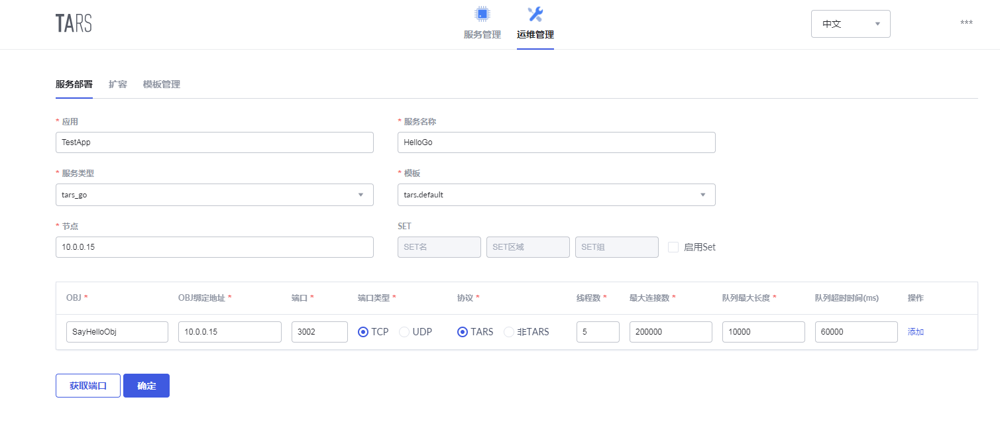
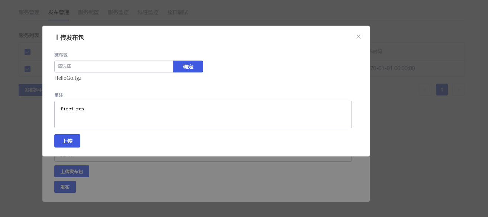

# Directory
> * [Department of management](#chapter-1)
> * [Service naming](#chapter-2)
> * [Service deployment](#chapter-3)
> * [Service publishing](#chapter-4)

## Department of management

After successful login, the user will enter the tars management system, as shown in the following figure:

Under the menu tree of tars management system, there are the following functions:

* Business management: including deployed services, as well as service management, release management, service configuration, service monitoring, feature monitoring, etc;
* Operation and maintenance management: including service deployment, expansion, template management, etc;

## Service naming

The service name of a service using the tars framework has three parts:

* APP：Application name, a small collection identifying a group of services. In the tars system, the application name must be unique。for example: TestApp；
* Server：Service name, the name of the process providing the service. The server name is named according to the business service function, generally named as:XXServer，for example:HelloServer；
* Servant：A server that provides an interface or instance of a specific service. for example:HelloObj

Explain:

- A server can contain multiple servants, and the system will use the app + server + servant of the service to combine them to define the routing name of the service in the system, which is called routing obj. Its name must be unique in the whole system, so that it can uniquely identify itself when serving external services
- Each servant corresponds to an independent port for external service.
- Therefore, when defining app, we need to pay attention to the uniqueness of app。

For example: TestApp.HelloServer.HelloObj

## Service deployment

Service deployment can also be done after service development, but it is recommended to do it first。

Click "operation" - & gt; "deployment" in the main menu, as shown below：

* “APP” Which application does your service belong to ，例如：“TestApp”. 
* “Server Name” Refers to the ID name of your service program，例如：“HelloServer”. 
* “Server Type” What language is your service program written in，例如：java的选择“tars\_java”. 
* “Template“ Refers to the name of the profile set by your service program when it starts.
* “Node“ Refers to the machine IP of service deployment. 
* “Set“ It refers to set grouping information of set service. Set information includes three parts: set name, set region and set group name. default not set.
* “OBJ“ Servant Name, for example: HelloObj
* “OBJ Bind IP“ It refers to the machine IP bound by the service, which is generally the same as the node.
* “Port“ OBJ Servant bind the port 
* “Port Type“ TCP or UDP
* “Protocol“ It refers to the communication protocol used by the application layer, and the tars service uses the tars protocol by default
* “Thread Num“ Refers to the number of business processing threads 
* “Max Connections“ Max Connections of server
* “queue length“ Refers to the size of the request receiving queue
* “Queue timeout“ Refers to the timeout of the request receiving queue

Click "submit". After success, the name of HelloServer will appear in the TestApp application under the menu number, and the information of your new service program will be seen on the right side, as shown below:

The deployment on the management system is here for the time being. So far, it only makes your service occupy a place on the management system. The real program has not been released.

## Service publishing

Under the menu tree of the management system, find the service you deployed and click to enter the service page.

Select publish management, select the node to publish, click publish selected node, click upload publish package, and select the compiled publish package, as shown in the following figure:

After uploading the release package, click the "select release version" drop-down box to display the service program you uploaded, and select the top one (the latest one uploaded).

Click "publish" to publish the service. After successful publishing, the following interface appears, as shown below:

If it fails, it could be naming issues, upload issues, and other environmental issues. Welcome to issue for discussion.
